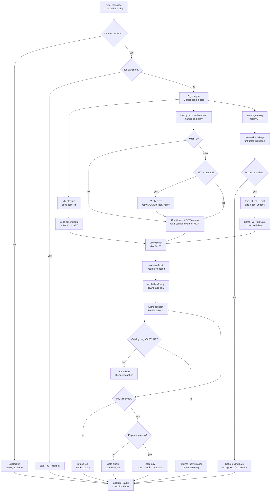
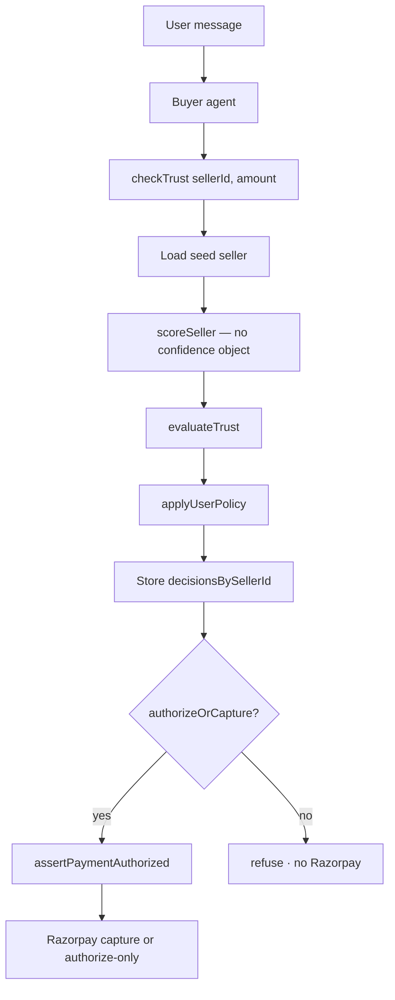
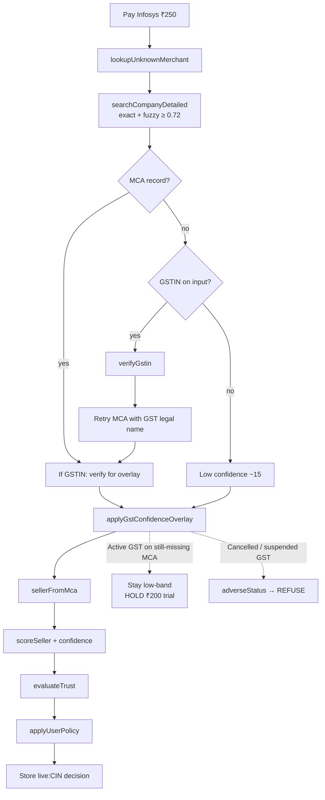
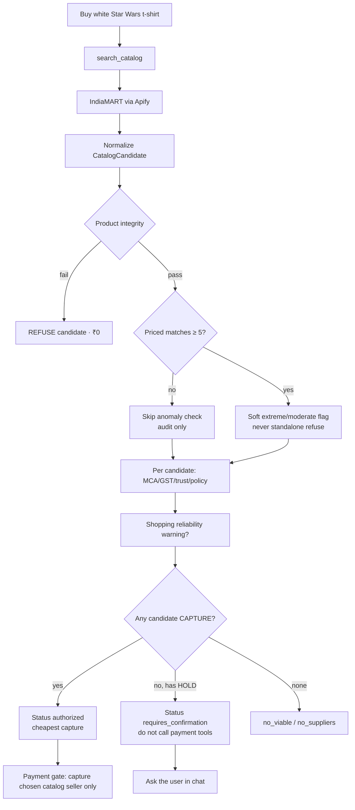
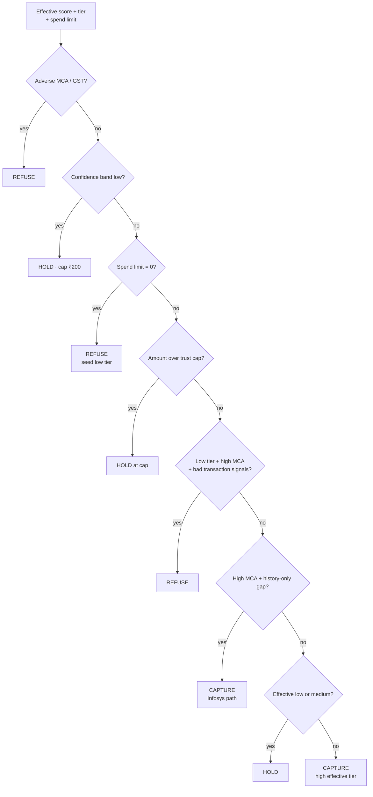
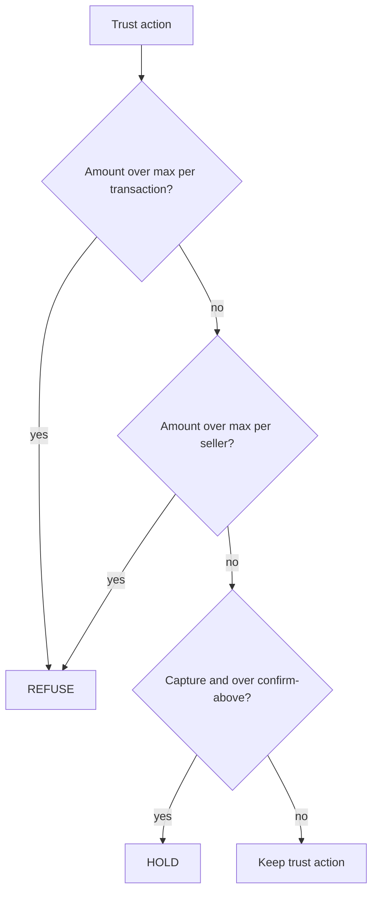
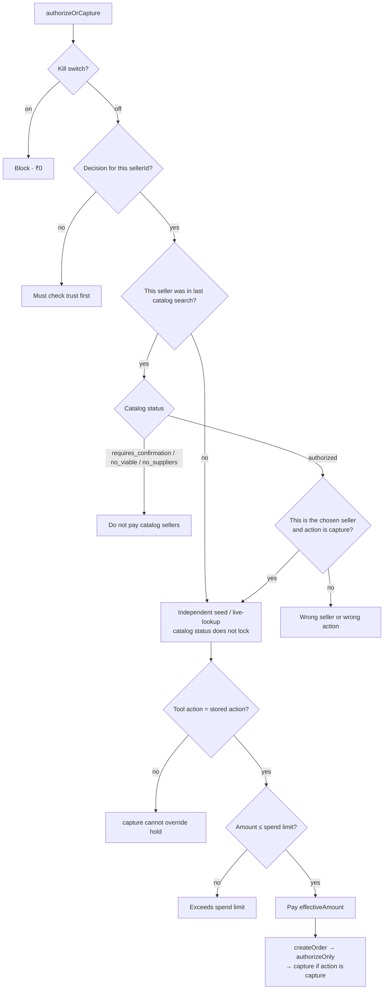

# TrustGate flow

End-to-end path of one purchase request: chat → gates → agent tools → trust/policy → Razorpay or refuse.

Shopping finds the deal. TrustGate decides whether money can move. The LLM prompt cannot override a stored decision.

---

## Entire request

**Catalog HOLD is not seed HOLD.** Seed / live-lookup HOLD still authorizes on Razorpay. Catalog `requires_confirmation` does not auto-pay in that request.

---

## Seed catalog

Used when the agent matches a merchant in `data/sellers.json`.

Examples: Spice Garden capture, Blue Bottle policy hold at ₹450, DealDash dispute-spike refuse.

---

## Live MCA / GST

Used when the payee is a real company not in the seed file.

GST is an identity bridge, not a substitute for MCA. Active GST cannot promote a miss into capture.

---

## Catalog / ShoppingAgent

Used when the product is outside seed listings. Needs `APIFY_TOKEN`.

---

## evaluateTrust — first match wins

Runs after `scoreSeller`. Live paths also apply confidence risk overrides and a registry floor before this chain.

Then **`applyUserPolicy`** (downgrade only):

---

## Payment gate

`assertPaymentAuthorized` runs inside `authorizeOrCapture` before any Razorpay call. The prompt is not enough.

If Razorpay times out or errors: retry once (~8s), then mark **flagged / unresolved** in the audit log.

---

## Outcomes

| Outcome | Razorpay |
|---------|----------|
| Capture | Authorize and take the money |
| Hold (seed / live-lookup) | Authorize only |
| Hold (catalog `requires_confirmation`) | No payment in this request |
| Refuse, kill switch, or payment-gate reject | No Razorpay call |
